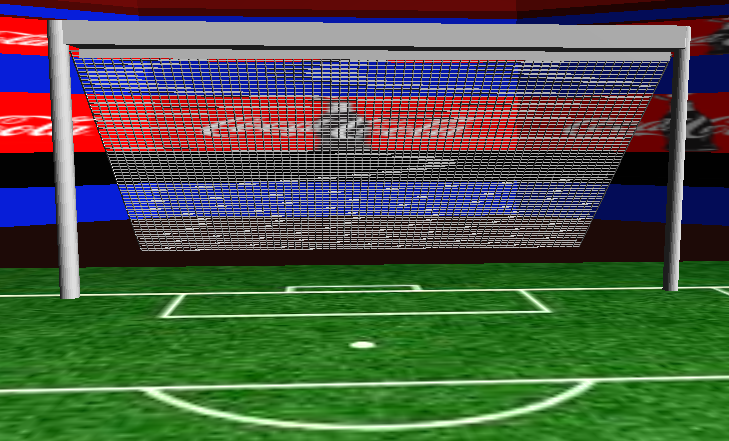
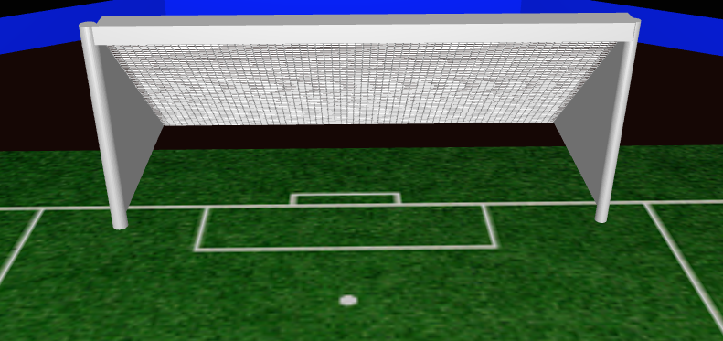

## 计算机图形学专选-HW2

## 评分点

**基本**

- [x] 加载复杂模型    10%
- [x] 纹理贴图    10%
- [x] 环境（定向）灯照明    10%
- [x] 您设计的光源照明    10%  （聚光灯）
- [x] 照明控制    10%
- [x] 纹理控制    10%
- [x] 对象控件    10%
- [x] 视图控件    10%

**额外任务**：增强场景的视觉效果

OpenGL为您的程序提供了许多功能来创建各种视觉效果。你可以自己研究它们，并将它们引入作业中

以下是一些建议的改进：

- [x] 加载更复杂的模型，并将其他纹理映射到它们上，以形成一个有意义的场景。(10%)

- [x] 使用不同类型的光源来制作有意义的场景，例如Pointlight、Spotlight等的组合（10%）

- [ ] 复杂模型上的阴影映射。(10%)

- [ ] 绘制点或线来跟踪其中一个复杂模型的运动。(10%)

- [x] 任何其他有趣的效果。

  > 智能光控灯（球场两边的聚光灯），天空盒，与足球交互（拾取/踢球等）

## 项目介绍

**项目名称：** **冰雪足球场：企鹅前锋**（Ice Soccer Field: Penguin Striker）

**项目概述：**
本项目基于 C++ 和 OpenGL（可编程渲染管线）构建了一个极地风格的 3D 交互场景。玩家控制一只企鹅，在带有完整足球场模型的雪地上自由移动、跳跃，并与足球进行带球、踢球等互动。项目中综合运用了 Assimp 模型加载、多纹理贴图、方向光与聚光灯双重照明系统、自动光照响应逻辑、摄像机控制、物体碰撞响应以及简单的物理运动模拟，旨在展示计算机图形学中高级渲染技术与实时交互系统的整合能力。

**核心玩法与特色功能：**

1. **自由的企鹅控制：**
   - 玩家通过方向键控制企鹅在雪地场景中**前进、后退、左右转向**。
   - 企鹅具备**跳跃**能力，可以增加趣味性。
2. **足球交互系统：**
   - 企鹅靠近足球时，足球会被**自动拾取**并跟随在身前。
   - 按下踢球键可将足球**水平踢出**，足球随后受重力影响自然下落并发生弹性碰撞。
   - 足球与地面、边界发生碰撞时伴随**速度衰减**与**摩擦效果**，模拟真实的物理滚动。
3. **智能动态照明系统：**
   - 场景包含**方向光**（模拟太阳/月光）和两盏覆盖球场的**聚光灯**。
   - **自动灯光切换**：系统会实时检测方向光亮度，当亮度低于预设阈值时，聚光灯**自动开启并恢复至合适亮度**，模拟黑夜/室内场景的照明补光；当方向光足够亮时，聚光灯自动关闭，回归日间自然光照效果。
   - 玩家可手动调节方向光亮度（E/Q）和聚光灯亮度（P/O），系统仍会根据方向光亮度自动覆盖聚光灯的开关状态。
   - 提供一键**日间/夜间模式切换**（T 键）：日间方向光亮、聚光灯自动关闭；夜间方向光变暗、聚光灯自动触发开启。
4. **纹理实时切换：**
   - 企鹅和雪地的纹理可通过数字键 **1/2** 和 **3/4** 进行实时切换，展示纹理贴图动态更新的能力。
5. **完整 3D 场景构成：**
   - 使用 Assimp 库加载**复杂足球场模型**（含多个子网格与材质），并分别应用纹理或颜色进行渲染。
   - 包含**企鹅模型**、**足球模型**、**雪地平台**和**天空盒**，构成完整的极地足球场环境。
6. **灵活的摄像机系统：**
   - 玩家可按 **W/A/S/D** 移动摄像机视角，按住**鼠标中键并拖动**可环顾四周，使用**鼠标滚轮**调整视野范围（FOV），从不同角度观察场景与光影效果。

## 交互

> 注：对照明控制和视图控件的按键进行了调整，要求文档里的按键感觉操作起来不舒服

| 分类                 | 按键/鼠标操作       | 功能描述                                                     |
| :------------------- | :------------------ | :----------------------------------------------------------- |
| **通用功能**         | **Key “Esc”**       | 退出程序。                                                   |
|                      |                     |                                                              |
| **视角/摄像机控制**  | **鼠标中键 + 移动** | **旋转视角**：在场景中自由环顾四周。                         |
|                      | **鼠标滚轮**        | **缩放视野**：上滑放大视野（镜头推近），下滑缩小视野（镜头拉远）。FOV 范围限制在 1°~45°。 |
|                      | **Key “W”**         | **视角前移**：摄像机向前平移。                               |
|                      | **Key “S”**         | **视角后移**：摄像机向后平移。                               |
|                      | **Key “A”**         | **视角左移**：摄像机向左平移。                               |
|                      | **Key “D”**         | **视角右移**：摄像机向右平移。                               |
|                      |                     |                                                              |
| **玩家（企鹅）控制** | **Key “↑” (UP)**    | **企鹅前进**：沿企鹅当前面向方向前进。                       |
|                      | **Key “↓” (DOWN)**  | **企鹅后退**：沿企鹅当前面向反向后退。                       |
|                      | **Key “←” (LEFT)**  | **企鹅左转**：顺时针旋转企鹅朝向（向左转）。                 |
|                      | **Key “→” (RIGHT)** | **企鹅右转**：逆时针旋转企鹅朝向（向右转）。                 |
|                      | **Key “SPACE”**     | **企鹅跳跃**：给企鹅一个向上的初速度，落回地面后自动重置跳跃状态。 |
|                      |                     |                                                              |
| **足球交互**         | **自动触发**        | **拾取足球**：企鹅靠近静止或低速运动的足球时，足球自动吸附至身前。 |
|                      | **Key “K”**         | **踢出足球**：将吸附的足球沿企鹅面向方向水平踢出（初速度水平），足球开始受重力下落并与地面发生弹性碰撞及摩擦减速。 |
|                      |                     |                                                              |
| **智能照明控制**     | **Key “E”**         | **增加方向光亮度**：增强方向光强度（用于日间或手动调节）。当方向光亮度回升超过阈值时，聚光灯会自动关闭。 |
|                      | **Key “Q”**         | **减小方向光亮度**：减弱方向光强度。当亮度低于阈值时，聚光灯**自动开启**并补光。 |
|                      | **Key “P”**         | **增加聚光灯光亮度**：手动增强球场两盏聚光灯的亮度（仅在聚光灯开启时有效）。 |
|                      | **Key “O”**         | **减小聚光灯光亮度**：手动减弱聚光灯亮度。                   |
|                      | **Key “T”**         | **日间/夜间模式一键切换**：日间模式（方向光亮，聚光灯自动关闭）↔ 夜间模式（方向光暗，聚光灯自动触发开启并恢复至初始亮度）。 |
|                      | (系统自动)          | **聚光灯自动开关**：当方向光亮度 < 0.2 时，聚光灯自动开启并恢复亮度；当方向光 ≥ 0.2 时，聚光灯自动关闭。该机制保证了夜间或黑暗环境下场景始终有主光源照明。 |
|                      |                     |                                                              |
| **纹理控制**         | **Key “1”**         | **企鹅纹理1**：切换企鹅纹理为 `penguin_01.png`（默认）。     |
|                      | **Key “2”**         | **企鹅纹理2**：切换企鹅纹理为 `penguin_02.png`（备选）。     |
|                      | **Key “3”**         | **雪地纹理1**：切换雪地纹理为 `snow_01.jpg`（默认）。        |
|                      | **Key “4”**         | **雪地纹理2**：切换雪地纹理为 `snow_02.jpg`（备选）。        |

## 写在最后

还是有一点小小的缺陷，用在线查看器/meshlab都能看到球门两边是封闭的，但是导入到场景后却是镂空的，尝试了几个小时之后没能达到满意的效果，只得暂时作罢

