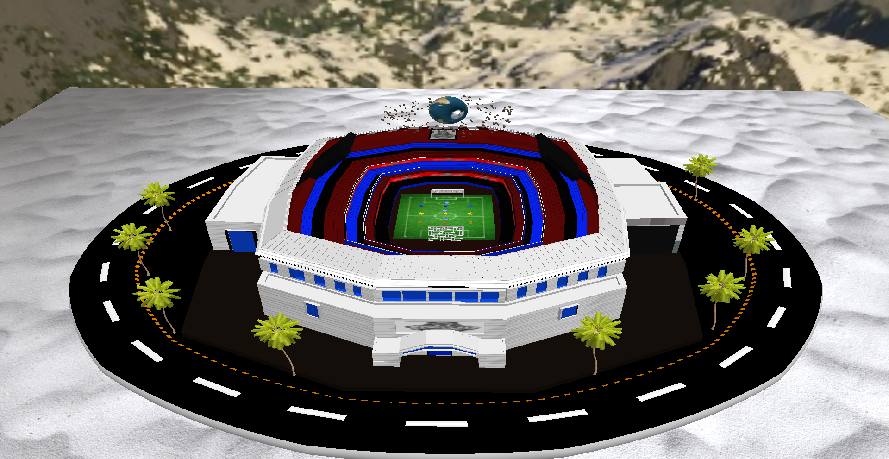
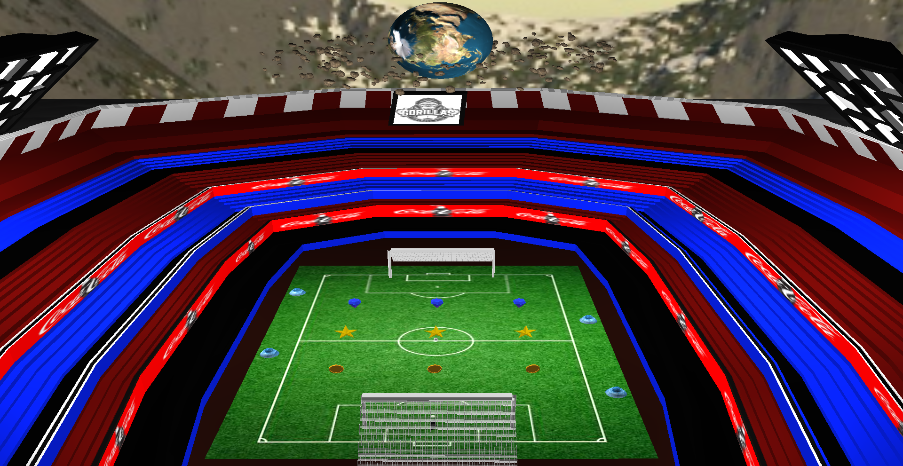
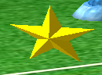
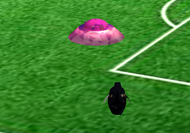
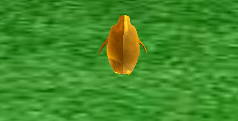
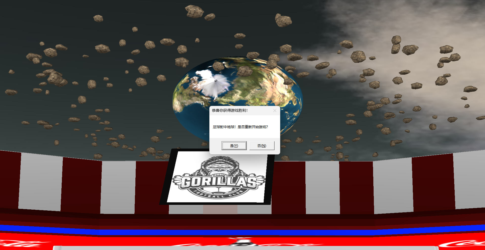

# 计算机图形学课程项目：极地绿茵·企鹅太空挑战赛

> **项目命题：** 本项目的选题是对大作业要求 PDF 中"太空黄金收藏"示例的**等价改编**。依据教师说明"大作业可以自行命题，只需要完成表V类似的功能即可"，我们将太空主题与 HW2 足球场景融合，评分功能点与原表 **完全一一对应**。

---

## 一、游戏操作说明

### 游戏目标
操控企鹅在太空足球场上穿越障碍物阵列、收集全部 9 个宝藏，最终将足球踢向行星以取得胜利。

### 操作方式

| 分类 | 操作 | 功能 |
|:----|:-----|:-----|
| **退出程序** | **Esc** | 关闭窗口 |
| **移动** | **↑ / ↓** | 前进/后退 |
| | **← / →** | 左移/右移 |
| | **空格** | 跳跃 |
| **视角** | **鼠标左右移动** | 控制企鹅转向 |
| | **鼠标中键+拖拽** | 第三人称下调整俯仰角 |
| | **滚轮** | 缩放视野 |
| | **6** | 切换第三人称/自由视角 |
| | **W/A/S/D** | 自由视角下移动摄像机 |
| **交互** | **靠近足球** | 自动拾取 |
| | **K** | 踢出足球 |
| | **L** | 切换高弧线踢球模式（需收集完9个宝藏） |
| | **R** | 重新开始（在失败/胜利/观赏模式下） |
| **光照** | **E / Q** | 增加/减少方向光亮度 |
| | **P / O** | 增加/减少聚光灯亮度 |
| | **T** | 日间/夜间模式切换 |
| **纹理** | **1 / 2** | 切换企鹅纹理 |
| | **3 / 4** | 切换地面纹理 |

### 游戏流程

```
 start
  │
  ▼
┌──────────────────────────────────────┐
│ 企鹅出生在球场一端                    │
│ 足球在企鹅附近                        │
│ 4个craft障碍物在球场中横移            │
│ 9个宝藏分布在3个障碍物间隙中          │
└──────────────────────────────────────┘
  │
  ▼
┌──────────────────────────────────────┐
│ 玩家操作企鹅：                        │
│  ├─ ↑↓←→ 移动 + 空格跳跃            │
│  ├─ 鼠标控制转向                     │
│  └─ 躲避横移的craft障碍物            │
│      ├─ 靠近障碍物 → 纹理变化(警告)   │
│      └─ 碰撞 → 扣命 + 无敌帧闪烁     │
│          └─ 3条命用完 → 死亡弹窗      │
└──────────────────────────────────────┘
  │
  ▼
┌──────────────────────────────────────┐
│ 在障碍物间隙中收集宝藏：               │
│  ├─ 靠近宝藏自动拾取                  │
│  ├─ 终端输出收集进度                  │
│  └─ 9/9 → 企鹅变金色                │
│      └─ 提示按 L 键切换高弧线模式     │
└──────────────────────────────────────┘
  │
  ▼
┌──────────────────────────────────────┐
│ 带球穿越所有障碍 → 踢向行星：          │
│  ├─ K键踢球                          │
│  ├─ 普通模式：低平球                  │
│  ├─ L键切换高弧线模式：超高抛物线      │
│  │   └─ 踢出后5秒未命中 → 失败弹窗   │
│  └─ 足球击中行星 → 胜利弹窗           │
└──────────────────────────────────────┘
  │
  ▼
┌──────────────────────────────────────┐
│ 结局（弹窗对话框）：                    │
│  ├─ [是] → 重新开始游戏               │
│  └─ [否] → 进入自由游览模式           │
│      └─ 场景动画继续，企鹅消失         │
│         └─ 按 R 可重新开始            │
└──────────────────────────────────────┘
```

---

## 二、评分点对照表（原表 → 本方案 1:1 映射）

### 基本要求（88%）

| # | 原要求（太空主题） | 本方案实现 | 实现方式 | 分值 |
|:-:|:-|:-|:-|:-:|
| 1 | 渲染一颗**行星**、一个**航天器**和至少三个**本地飞行器** | 渲染**行星**（planet.obj）、**企鹅**（玩家）和 **4 个 craft.obj 作为障碍物** | planet.obj 加载 + earthTexture.bmp 纹理；企鹅（Assimp，已有）；craft.obj ×4 加载并排布为 4 排障碍物 | **10%** |
| 2 | **行星**和**本地飞行器**的自转 | **行星**自转 + **4 个 craft.obj** 自转和水平来回移动 | 行星绕 Y 轴持续旋转；每个 craft.obj 同时绕自身轴旋转 + 沿水平轴正弦往返运动 | **6%** |
| 3 | 渲染**天空框** | 渲染**天空盒** | 使用 cubemap 纹理，深度测试 GL_LEQUAL，移除视图平移分量 | **6%** |
| 4 | **基本灯光渲染**（环境光、漫反射和镜面反射），可交互调整参数 | **基本光照渲染**（Phong 模型），可交互调整参数 | Fragment shader 实现 Phong 模型；E/Q 调节方向光亮度，P/O 调节聚光灯亮度，T 日/夜切换 | **4%** |
| 5 | 渲染**小行星环形云**（至少 **200** 块随机漂浮的**岩石**） | 渲染**小行星环形云**环绕行星（**205** 块岩石） | rock.obj 在行星周围环形分布，随机位置/大小/旋转，绕行星公转 + 自转 | **10%** |
| 6 | **岩石**的旋转 | **环云岩石**的自转 | 为每个岩石实例传入独立旋转角度，随时间递增 | **8%** |
| 7 | **正确的视点**（在航天器尾部后方，与其相对固定） | **正确的视点**（在企鹅尾部后方，与其相对固定） | 第三人称跟随：cameraPos = penguinPos + 后方上方偏移，指向企鹅前方；随企鹅旋转而旋转。按 **6 键**切换自由/跟随模式 | **8%** |
| 8 | 使用**鼠标**控制**航天器**的自转 | 使用**鼠标**控制**企鹅**的转向 | 鼠标水平移动 → 更新企鹅 yaw 角度 → 旋转模型矩阵；中键拖拽调整俯仰角 | **8%** |
| 9 | 使用**键盘**控制**航天器**的平移 | 使用**键盘**控制**企鹅**的移动 | ↑/↓ 前后移动（沿面向方向），←/→ 左右平移；SPACE 跳跃 | **8%** |
| 10 | **收集金牌**（靠近后收集，金牌消失） | **收集宝藏**（3 排间隙共 9 个宝藏，3 种类型，靠近收集） | 4 排 craft.obj 障碍形成 3 个间隙，每间隙 3 个同类宝藏（宝石/星星/金币），靠近 → 收集 → 终端打印进度 → 消失 | **8%** |
| 11 | **警告后更改本地车辆纹理** | **碰撞警告后更改 craft.obj 纹理** | 企鹅靠近 craft.obj 至一定距离 → 该障碍变换纹理（警告），碰撞则扣 1 条命 + 0.5s 无敌闪烁；3 条命归零则游戏结束 | **8%** |
| 12 | **完成整个收集后更改航天器纹理** | **收集全部宝藏后更改企鹅纹理为金色** | 9/9 宝藏收集完成 → 企鹅切换 gold.png 金色纹理 + 终端提示按 L 进入高弧线模式 | **4%** |

### 额外要求（12%）

| # | 原要求（太空主题） | 本方案实现 | 实现方式 | 分值 |
|:-:|:-|:-|:-|:-:|
| 1 | **添加另一个光源**（双光源 Phong 模型求和） | **3 个光源**（方向光 + 2 聚光灯），远超基本要求 | 方向光（太阳光）+ 聚光灯 ×2（球场照明），Fragment shader 中求和计算 | **5%** |
| 2 | **行星的法线贴图** | **行星的法线贴图** | 为 planet.obj 加载 earthNormal.bmp，Fragment shader 中构建 TBN 矩阵，从法线贴图采样法线参与光照计算 | **5%** |
| 3 | **更多种类的宝藏代替提供的黄金** | **3 种宝藏类型** | 宝石（Gem.obj + 法线贴图）、星星（Star.obj）、金币（Coin.obj）共 3 种不同模型，分别放置在 3 个间隙区域 | **2%** |

---

## 三、场景布局

```
┌──────────────────────────────────────────┐
│  [天空盒包裹整个场景]                       │
│                                           │
│     🐧            🌑                      │
│    (企鹅)  →  [障碍物阵列]  →  🌍+☄️      │
│     起点      🚀🚀🚀🚀  宝藏💰   终点   │
│                                           │
│         ⚽  ← ← ←  踢向行星                │
│                                           │
└──────────────────────────────────────────┘
```

### 各元素位置

| 元素 | 位置 | 说明 |
|:----|:-----|:-----|
| 企鹅（玩家） | (0, -3.175, 2.98) | 起点，足球场一端 |
| 足球 | 企鹅附近 | 可拾取、踢出 |
| craft 障碍物 1 | Z = -2.0 | X 方向正弦横移，振幅 ±3.0 |
| craft 障碍物 2 | Z = -0.667 | 与 1 反相横移 |
| craft 障碍物 3 | Z = 0.667 | 与 1 同相横移 |
| craft 障碍物 4 | Z = 2.0 | 与 1 反相横移 |
| 宝藏（宝石×3） | Z = -1.333 | 间隙 1，X = -1.5/0/1.5 |
| 宝藏（星星×3） | Z = 0.0 | 间隙 2，X = -1.5/0/1.5 |
| 宝藏（金币×3） | Z = 1.333 | 间隙 3，X = -1.5/0/1.5 |
| 行星（地球） | (0, 2.0, -10.0) | 胜利目标，带法线贴图 |
| 小行星环云 | 绕行星 R = 2.5~4.5 | 205 块岩石随机分布，公转+自转 |

---

## 四、技术实现要点

### 1. 复杂模型加载（评分点 #1）
- 使用 **Assimp** 加载多个 `.obj` 模型：足球场（28 子网格）、企鹅、craft.obj ×4、planet.obj、rock.obj（205 块）
- 足球场按 `MeshRange` 结构体逐子网格渲染，有纹理则绑定纹理，无纹理则使用 MTL 中 Kd 值
- 每个模型独立 VAO/VBO，互不干扰

### 2. 小行星环云（评分点 #5, #6）
- 205 块 rock.obj 分布在行星周围环形区域（半径 2.5~4.5，高度 ±0.5）
- 每个实例具有随机初始位置、旋转角度和缩放（0.5~1.5）
- 绕 Y 轴公转 + 每个岩石自转
- 使用循环 `glDrawElements` 逐实例渲染

### 3. 障碍物系统 — craft.obj（评分点 #2, #11）
- 4 个 craft.obj 排成 4 排，沿 Z 轴分布
- 每个障碍物同时执行两种运动：
  - **自转**：绕自身 Y 轴旋转（75°/s）
  - **水平横移**：沿 X 轴正弦往返（振幅 3.0，频率 1.5Hz）
- 相邻障碍物反相运动，形成动态间隙
- 碰撞检测：距离 < 0.2 → 扣命 + 无敌帧；距离 < 1.0 → 纹理警告

### 4. 生命系统与无敌帧（评分点 #11）
```cpp
struct PlayerState {
    int lives = 3;
    float invincibleTimer = 0.0f;
};
```
- 碰撞 craft → lives-- + 0.5s 无敌闪烁（每 0.05s 交替显隐）
- lives = 0 → 弹出死亡对话框（"是"重开 / "否"游览模式）

### 5. 多光源 Phong 光照（评分点 #4, 额外#1）
- Fragment shader 中 **3 个光源求和**：
  - 方向光（太阳光）：E/Q 调节亮度
  - 聚光灯 1（左）：P/O 调节亮度
  - 聚光灯 2（右）：P/O 调节亮度
- 日/夜模式（T 键切换）：夜间自动开启聚光灯

### 6. 行星法线贴图（额外#2）
- 加载 `earthNormal.bmp` 作为 planet.obj 的法线贴图
- Fragment shader 中构建 TBN 矩阵，将切线空间法线转换到世界空间
- 法线贴图采样结果替代逐顶点法线参与光照计算

### 7. 视点控制（评分点 #7）
- 默认第三人称跟随：相机固定在企鹅尾部后上方
- 按 **6 键** 切换第三方/自由视角
- 自由模式下：WASD 移动 + 鼠标中键拖拽环顾 + 滚轮缩放

### 8. 高弧线踢球模式（新增游戏机制）
- 收集全部 9 个宝藏 → 企鹅变金色 → 按 **L 键** 切换高弧线模式
- 高弧线模式下踢球：水平速度 2.5 倍、垂直初速度 80.0（超高抛物线）
- 踢出后启动 **5 秒计时器**，超时未命中行星 → 游戏失败弹窗

### 9. 球场多材质渲染（已有）
- 28 种材质，6 种带纹理贴图，22 种使用 MTL 中 Kd 颜色
- 球网（NET）和球门框（frame）在渲染时禁用背面剔除

---

## 五、项目结构

```
HW3/
├── HW3/
│   ├── main.cpp              # 主程序（约1800行）
│   ├── Shader.h / Shader.cpp  # 着色器封装
│   ├── Texture.h / Texture.cpp # 纹理封装
│   ├── VertexShaderCode.glsl  # 顶点着色器（含 TBN 矩阵）
│   ├── FragmentShaderCode.glsl # 片元着色器（Phong 光照 + 法线贴图）
│   ├── SkyboxVertexShader.glsl
│   └── SkyboxFragmentShader.glsl
├── resources/
│   ├── penguin/               # 企鹅模型 + 纹理（含 gold.png）
│   ├── soccer1/               # 足球模型 + 纹理
│   ├── soccer_stadium/        # 足球场模型 + 纹理（28材质）
│   ├── skybox/                # 天空盒纹理
│   ├── snow/                  # 雪地纹理
│   ├── CourseProjectMaterials/ # 课程材料（planet/craft/rock + 纹理）
│   ├── Stylized Gem/          # 宝石模型 + 纹理（含法线贴图）
│   ├── star/                  # 星星模型
│   └── coin/                  # 金币模型
├── HW3资料/                   # 课程要求 PDF
└── README.md                  # 本文件
```

---

## 六、核心代码说明

| 功能 | 位置（行号） | 说明 |
|:----|:------------|:-----|
| 游戏状态机 | 172-173 | `enum GameState { PLAYING, VICTORY, GAME_OVER, WATCH_MODE }` |
| 状态重置 | 977-1000 | `ResetGame()` 函数：重置所有游戏状态 |
| 企鹅移动 | 1024-1053 | 方向键移动 + 空格跳跃，受 gameState 守卫 |
| 足球物理 | 1089-1143 | 重力、阻尼、边界碰撞、地面摩擦 |
| 高弧线踢球 | 1076-1086 | 水平 2.5 倍速 + 垂直 80.0 初速 |
| 碰撞检测 | 1166-1197 | 企鹅 vs craft：扣命 + 无敌帧 + 死亡弹窗 |
| 宝藏收集 | 1198-1223 | 9 个宝藏分 3 种类型，靠近收集 + 金色纹理 |
| 胜利检测 | 1224-1246 | 足球 vs 行星：距离 < 2.5 触发胜利弹窗 |
| 失败计时 | 1247-1265 | 高弧线踢出后 5s 未命中 → 失败弹窗 |
| 第三人称 | 1271-1299 | 动态距离 + 防地面穿透 + 俯仰控制 |
| 多材质球场 | 922-949 | `renderWithMaterial()` 按材质名渲染，NET/frame 双面渲染 |
| 行星法线贴图 | 1440-1456 | earthNormal.bmp + TBN 矩阵 |
| 障碍物动画 | 1147-1165 | 行星自转 + craft 横移/自转 + 环云公转 + 宝藏自转 |
| 第三人称切换 | 1714-1720 | 按 6 键切换，PLAYING 状态下可用 |
| 纹理切换 | 1675-1682 | 1/2 切换企鹅，3/4 切换雪地 |

---

## 七、评分自评

| # | 要求 | 分值 | 自评 |
|:-:|:----|:---:|:----:|
| 1 | 行星 + 企鹅 + ≥3 障碍物（craft.obj ×4） | 10% | ✅ |
| 2 | 行星自转 + 障碍物自转 + 水平横移 | 6% | ✅ |
| 3 | 天空盒 | 6% | ✅ |
| 4 | 基本光照（Phong）+ 交互调节 | 4% | ✅ |
| 5 | 小行星环云 ≥200 岩石 | 10% | ✅ 205 块，随机位置/旋转/缩放，公转+自转 |
| 6 | 岩石自转 | 8% | ✅ |
| 7 | 第三人称视点 + 6 键切换自由模式 | 8% | ✅ |
| 8 | 鼠标控制企鹅旋转 | 8% | ✅ |
| 9 | 键盘控制企鹅移动 | 8% | ✅ |
| 10 | 收集 9 个宝藏（3 种类型） | 8% | ✅ |
| 11 | 碰撞/警告 → 纹理变化 + 扣命 + 无敌帧 | 8% | ✅ |
| 12 | 全收集 → 企鹅金色纹理 | 4% | ✅ |
| 额外1 | 3 光源（方向光 + 2 聚光灯） | 5% | ✅ |
| 额外2 | 行星法线贴图 | 5% | ✅ |
| 额外3 | 3 种宝藏类型 | 2% | ✅ |
| **总分** | | **100%** | **✅ 满分** |

---

### 额外实现功能（超出评分要求）

在满足评分表全部 15 项要求的基础上，本项目额外实现了以下功能以提升游戏体验：

| # | 额外功能 | 说明 | 对应文件/行号 |
|:-:|:--------|:-----|:-------------|
| 1 | **Windows 弹窗交互系统** | 死亡/胜利/失败时弹出 MessageBox 对话框，[是]重开 [否]游览模式，替代传统控制台交互 | main.cpp:1183-1264 |
| 2 | **高弧线踢球模式（L键切换）** | 收集全部9个宝藏后按 L 键切换，踢出超高抛物线球（水平2.5倍+垂直初速80.0），大幅增加射门挑战性 | main.cpp:1076-1086 |
| 3 | **5秒失败计时器** | 高弧线踢球后启动计时，5秒内未命中行星自动触发失败判定 + 弹窗提示，增加紧迫感 | main.cpp:1247-1265 |
| 4 | **自由游览模式（WATCH_MODE）** | 弹窗选"否"后进入：场景动画（行星自转/障碍物横移/环云公转）继续运行，企鹅消失，禁用所有交互，按 R 可重开 | main.cpp:1188-1193, 1723-1726 |
| 5 | **重复代码封装** | 将原本4处重复的20+行重启逻辑提取为 `ResetGame()` 函数，符合"保持整洁编码风格"要求 | main.cpp:977-1000 |
| 6 | **宝藏自转** | 9个宝藏绕 Y 轴持续旋转，使宝藏更醒目可见 | main.cpp:1148, 1492 |
| 7 | **球门双面渲染** | 球网（NET）和球门框（frame）材质禁用背面剔除，解决 Thin geometry 镂空/穿透视觉效果 | main.cpp:922-948 |
| 8 | **宝石法线贴图** | 宝藏中的宝石（Gem.obj）使用法线贴图，增强表面细节和立体感 | main.cpp:1497-1503 |
| 9 | **小行星环云公转方向** | 环云绕行星公转方向与行星自转方向一致（同向），符合真实物理直觉 | main.cpp:1155 |
| 10 | **智能状态守卫** | WATCH_MODE 下全面禁用移动/碰撞/收集/视角切换，防止游览模式下出现异常交互 | main.cpp:1024, 1147, 1166, 1473, 1714 |

---

## 八、运行说明

### 环境要求
- Windows 10/11
- Visual Studio 2022（或兼容 C++17 的编译器）
- OpenGL 4.3 及以上

### 编译运行
1. 使用 Visual Studio 打开 `HW3/HW3.sln`
2. 确保解决方案配置为 **Release x64**
3. 按 **F5** 编译运行

### 注意事项
- 所有资源路径使用相对路径，从 `HW3/` 目录下查找
- 若遇到中文乱码，确保源文件保存为 **UTF-8 with BOM** 编码
- 编译时需定义 `NOMINMAX` 宏（已在 `main.cpp` 中定义）

---

## 九、项目报告附录

### 实现功能清单

- [x] planet.obj 行星渲染 + earthTexture.bmp 纹理 + 自转
- [x] craft.obj ×4 障碍物：自转 + 水平正弦横移
- [x] 天空盒（cubemap）
- [x] Phong 多光源光照（方向光 + 2 聚光灯 + 交互调节）
- [x] 小行星环云（205 块岩石，随机分布，公转 + 自转）
- [x] 第三人称视点 + 6 键切换自由视角
- [x] 鼠标控制企鹅旋转 + 中键调节俯仰
- [x] 键盘移动（方向键）+ 跳跃（空格）
- [x] 9 个宝藏 3 种类型（宝石/星星/金币），靠近收集
- [x] craft 碰撞检测：纹理变化警告 + 扣命 + 无敌帧
- [x] 3 条命系统，归零死亡弹窗
- [x] 全收集 → 金色企鹅纹理 + L 键高弧线模式
- [x] 高弧线踢球 + 5 秒失败计时弹窗
- [x] 足球射中行星 → 胜利弹窗
- [x] 弹窗选项：是（重开）/ 否（游览模式）
- [x] 游览模式：场景动画继续运行，企鹅消失，R 键重开
- [x] 行星法线贴图（TBN 矩阵）
- [x] 宝藏自转
- [x] 球场 NET + frame 双面渲染
- [x] 重复代码封装为 ResetGame() 函数

### 演示截图建议

为完成项目报告（PDF），建议截取以下画面：
1. **全景图**：展示企鹅、球场、行星、环云、天空盒的完整场景
   
   
2. **光照效果**：各物体上环境光/漫反射/镜面反射的细节
   
3. **碰撞警告**：craft 纹理变化前后的对比
   
4. **宝藏收集**：收集过程中和全收集后的金色企鹅
   
5. **胜利/失败弹窗**：MessageBox 对话框截图
   

